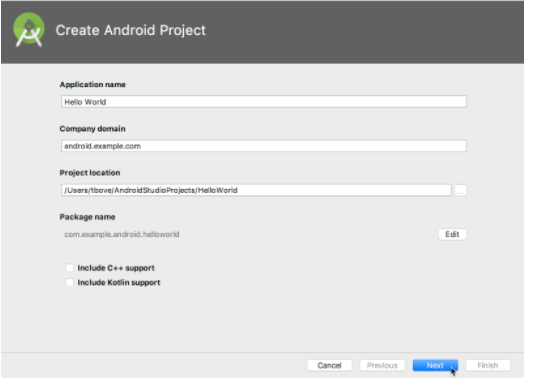
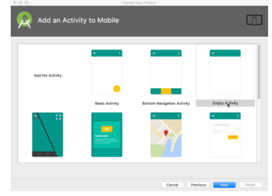
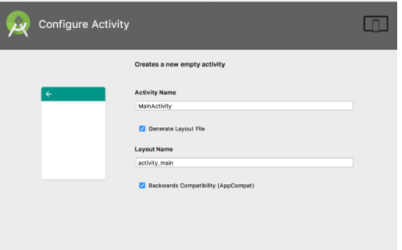
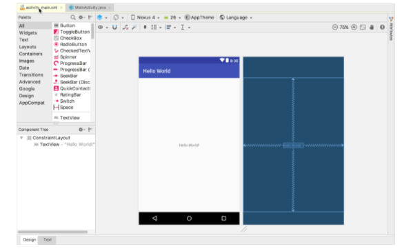
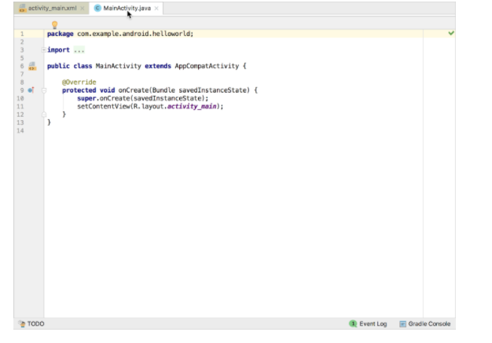

# DSC-IBA | Android Bootcamp

# Day 1 (An introduction to the environment)

By Ahmed Mustafa, Core Team member and Android lead @ DSC-IBA

## TASK 1: Install Android Studio

Android Studio provides a complete integrated development environment (IDE) including an advanced code editor and a set of app templates. In addition, it contains tools for development, debugging, testing, and performance that make it faster and easier to develop apps. You can test your apps with a large range of preconfigured emulators or on your own mobile device, build production apps, and publish on the Google Play store.

Download the latest at [Android Studio](https://developer.android.com/studio/index.html)

## TASK 2: Create the Hello World app

In this task you'll create a new project to know that Android Studio is working fine on your system.

# Create the app project
  1) Open Android Studio
  2) In the main Welcome to Android Studio window, click Start a new Android Studio project.
  3) In the Create Android Project window, enter Hello World for the Application name.

  5) Verify that the default Project location is where you want to store your Hello World app and other Android Studio projects, or      change it to your preferred directory.
  6) Accept the default android.example.com for Company Domain, or create a unique company domain.
  7) If you are not planning to publish your app, you can accept the default. Be aware that changing the package name of your app         later is extra work.

  8) Leave unchecked the options to Include C++ support and Include Kotlin support, and click Next.
  9) On the Target Android Devices screen, Phone and Tablet should be selected. Ensure that API 17 is set as the Minimum SDK; if it is not, use the popup menu to set it.
  
  10) The Add an Activity window appears. An Activity is a single, focused thing that the user can do. It is a crucial component of any Android app. An Activity typically has a layout associated with it that defines how UI elements appear on a screen. Android Studio provides Activity templates to help you get started. For the Hello World project, choose Empty Activity as shown below, and click Next.
  

11) The Configure Activity screen appears (which differs depending on which template you chose in the previous step). By default, the empty Activity provided by the template is named MainActivity. You can change this if you want, but this lesson uses MainActivity.

12) Make sure that the Generate Layout file option is checked. The layout name by default is activity_main. You can change this if you want, but this lesson uses activity_main.
13) Make sure that the Backwards Compatibility (App Compat) option is checked. This ensures that your app will be backwards-compatible with previous versions of Android.
14) Click Finish.

15) Click on activity_main.xml tab to see the layout editor:

16) Click on activity_main.xml tab to see the layout editor:

