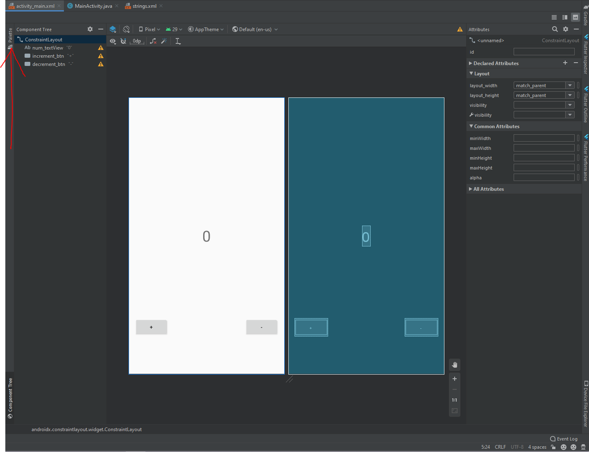

# DSC-IBA | Android Bootcamp

# Day 1 (An introduction to the environment)

By Ahmed Mustafa, Core Team member and Android lead @ DSC-IBA

# TASK 1: Open activity_main.xml

On your left panel, make sure you've selected Android. Then:
Press app -> res -> layout -> open activity_main.xml

# TASK 2: Open XML editing and Palette

Follow the arrows in the picture to do the above mentioned two things.

## For XML editing mode:

## To open Palette:

# TASK 3: Change text from hello world to your name and give it an id.

#TASK 4: Drag and drop a button on your screen

Download the latest at [Android Studio](https://developer.android.com/studio/index.html)

