# DSC-IBA | Android Bootcamp

# Day 1 (An introduction to the environment)

By Ahmed Mustafa, Core Team member and Android lead @ DSC-IBA

# Front End:

# Widgets we used today:

## Button:
We created two buttons today, an increment and a decrement button.

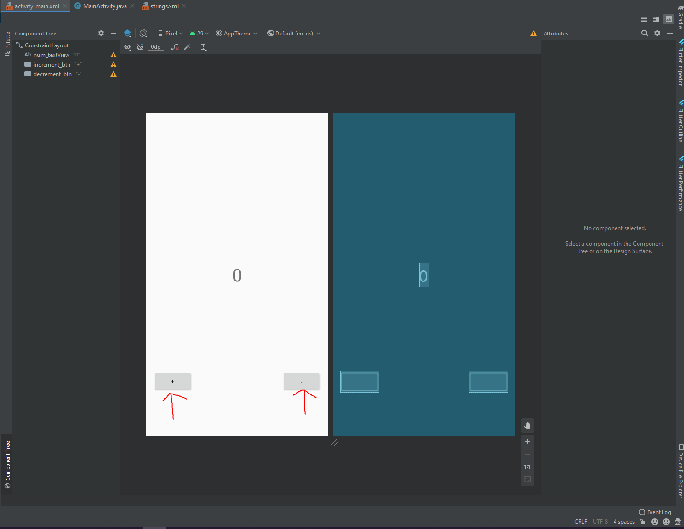

## TextView:
We also created a TextView today to save the result of our actions if you remember clearly.

## TASK 1: Open activity_main.xml

On your left panel, make sure you've selected Android. Then:
Press app -> res -> layout -> open activity_main.xml

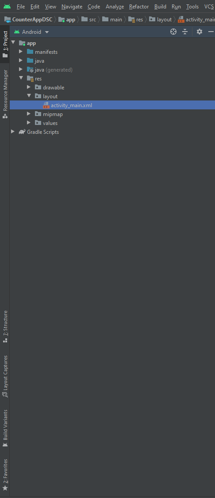

## TASK 2: Open XML editing and Palette

Follow the arrows in the picture to do the above mentioned two things.

### For XML editing mode:

### To open Palette:

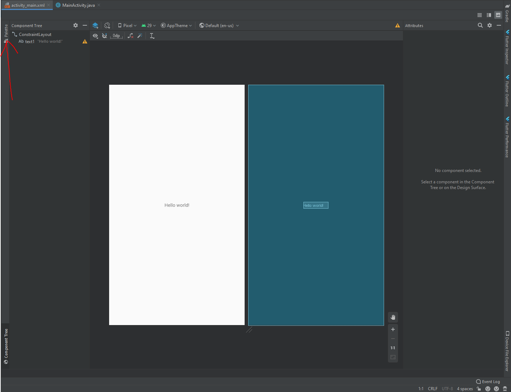

## TASK 3: Change text from hello world to your name and give it an id.

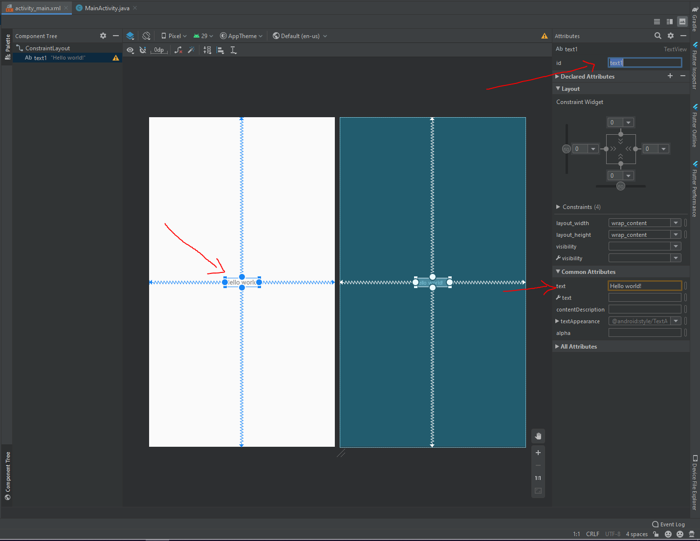

## TASK 4: Drag and drop a button on your screen

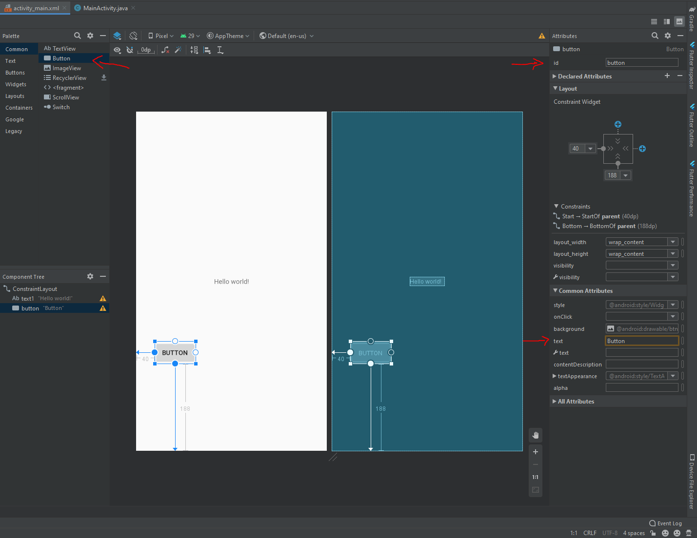

# Back End:

## TASK 1: Open MainActivity.java

On your left panel again, make sure you've selected Android on top. Then:
Press app -> java -> com.example.yourappname -> MainActivity

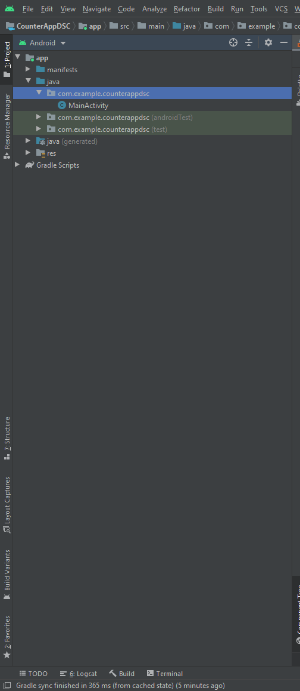

## TASK 2: Declare variables

There are multiple ways to declare variables. For modularity, we'll declare them at the top under:
public class MainActivity extends App Compat Activity{

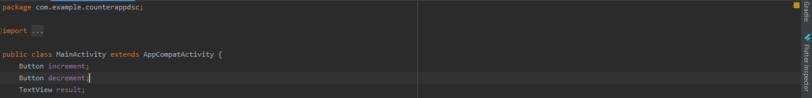

Here:

We have declared two Buttons called increment and decrement respectively.
We have also declared a TextView called result.

## TASK 3: Initialize variables

In order to bind declared variables to our backend, we use "findViewById" method and Android's "R" class.
The following code snipped initialises our previously declared variables increment, decrement and result to their respective front-end variables with ids: increment_btn, decrement_btn and num_textView

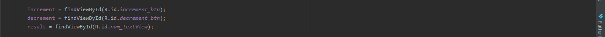

## TASK 4: OnClick Listeners

Since we have two buttons with separate functionality (one increments our result and one decrements), hence we need two separate on click listeners.

The function onClick gets triggered everytime you press the widget its applied to.

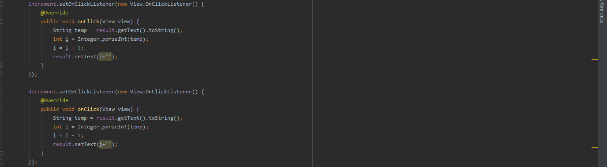

## Front End Code:

The picture attached below contains all the code that we wrote today. On the right, it also shows how it looks like on screens.

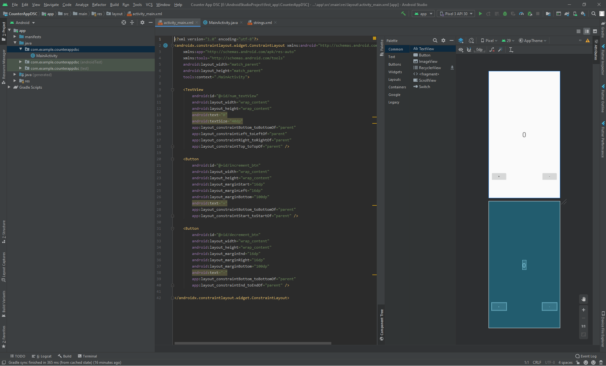

## Back End Code:

This is the entire code we've written today. Remember that Line 19 (which I've highlighted), was used to show an output on our Logcat.

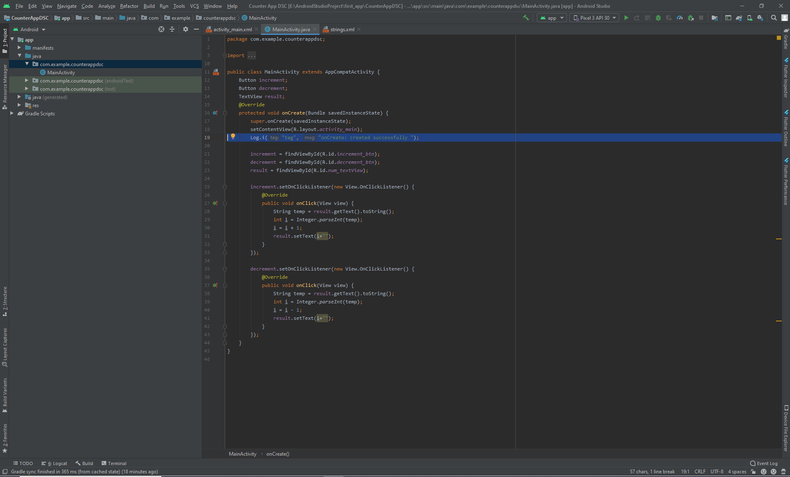

## Final App:

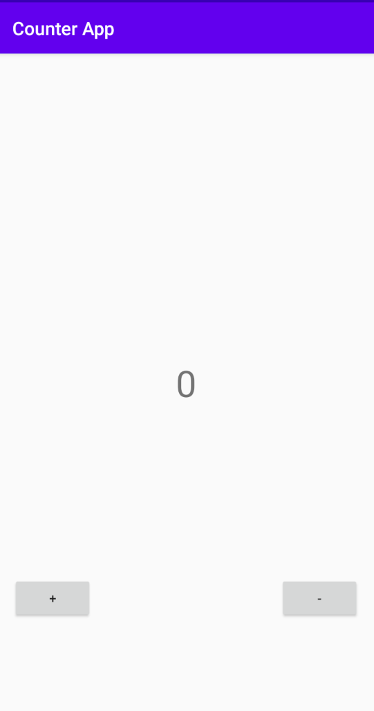

### Tada!!!
We've finally done it! Our counter app is up and running on our emulators!

Thanks for coming!

Download the latest Android Studio at [Android Studio](https://developer.android.com/studio/index.html)

