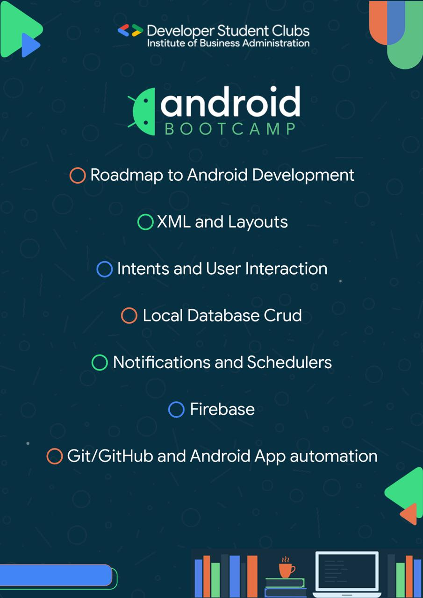

# DSC-IBA | Android Bootcamp

This is the official repository for Android Bootcamp by DSC-IBA

# Day 1 (An introduction to the environment)

By Ahmed Mustafa, Core Team member and Android lead @ DSC-IBA

# Install Android Studio

Android Studio provides a complete integrated development environment (IDE) including an advanced code editor and a set of app templates. In addition, it contains tools for development, debugging, testing, and performance that make it faster and easier to develop apps. You can test your apps with a large range of preconfigured emulators or on your own mobile device, build production apps, and publish on the Google Play store.

Download the latest at [Android Studio](https://developer.android.com/studio/index.html)

# Setting Up The Environment

Follow the tasks on here to gain a better understanding! 
Homework tab on [here](https://developer.android.com/codelabs/android-training-hello-world?index=..%2F..%2Fandroid-train) is your assignment
Upload screenshots, compile in word document/pdf and submit on Google Classroom. Code: 6vkwowo

## Happy coding!